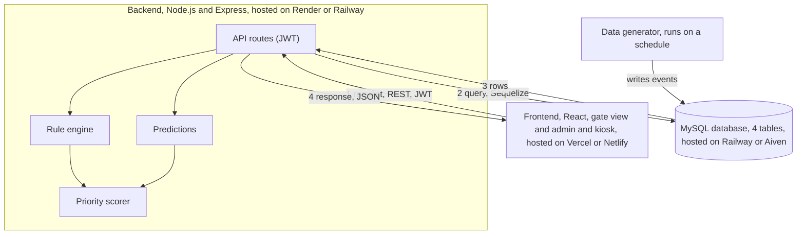
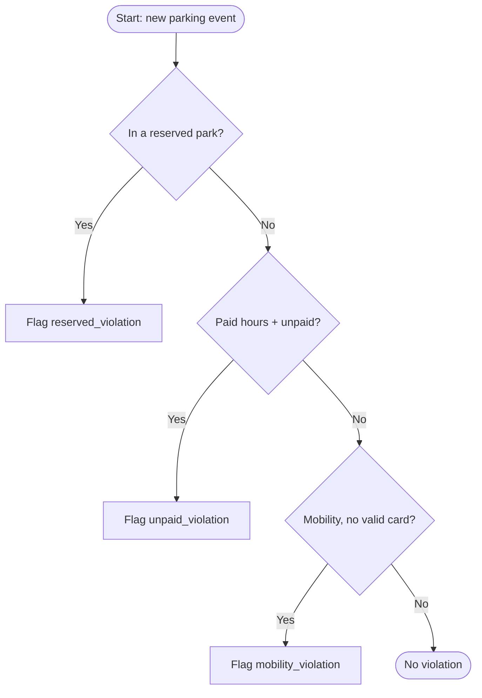

# Campus Parking System — Diagrams (as code)

These diagrams are written in Mermaid syntax. GitHub renders them automatically when this file is viewed in the repository.

## 1. System architecture diagram (includes deployment)

Numbers on the arrows show the order of a request: the frontend asks the backend for data (1), the backend queries the database (2), the database returns rows (3), and the backend sends the result back to the frontend (4). Each box also lists where it runs once deployed.

## 2. Rule engine flowchart

## 3. Data generator flowchart

