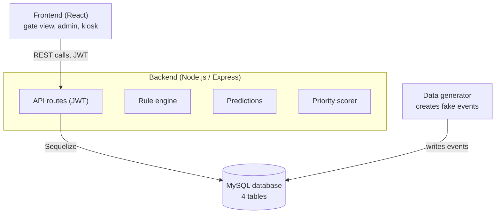
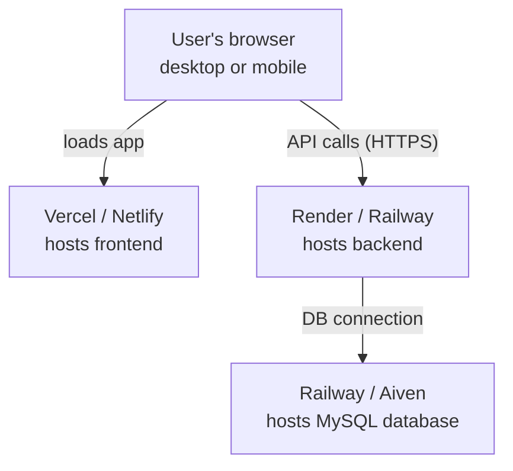
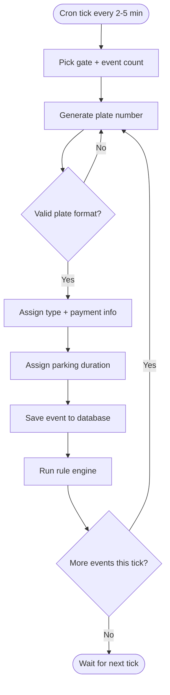

# Campus Parking System — Diagrams (as code)

These diagrams are written in Mermaid syntax. GitHub renders them automatically when this file is viewed in the repository.

## 1. System architecture diagram

## 2. Deployment diagram

## 3. Rule engine flowchart

## 4. Data generator flowchart

